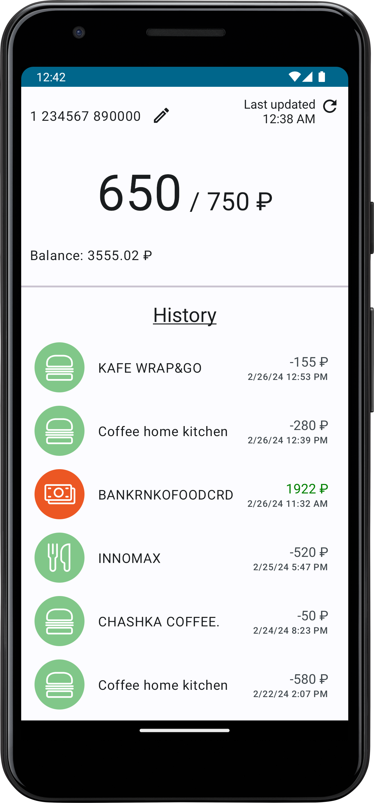
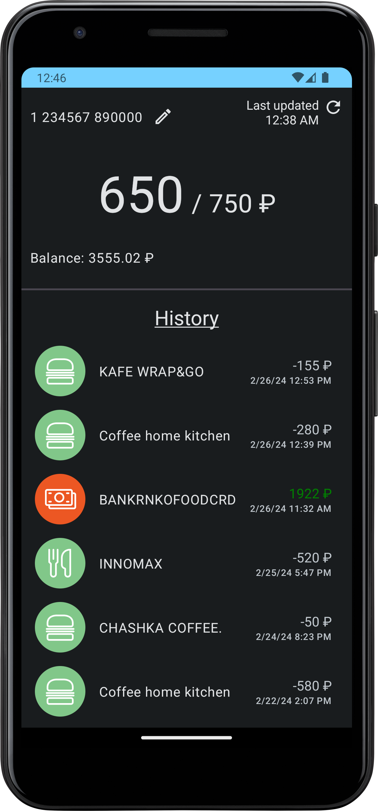
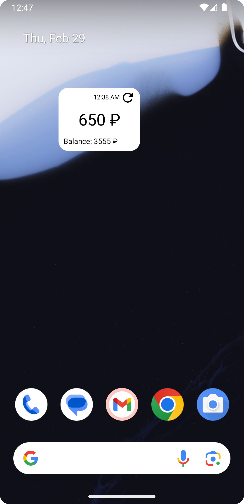

# СУП Balance

This app is an alternative interface to the [check balance page](https://meal.gift-cards.ru/balance)
of the [СУП](https://prostodar.ru/sup) service used by some companies in Russia.
This app is not affiliated with СУП in any way, I was just frustrated by how slow and non-responsive
their website is, so I decided to use their API and learn native Android development for fun.

Additionally, the app provides a home screen widget for quick checking of the remaining balance for
the day, as well as a background service to automatically update the balance info periodically.

## Screenshots

| Light mode                           | Dark mode                                 | Widget (resizable)            |
|--------------------------------------|-------------------------------------------|-------------------------------|
|  |  |  |
